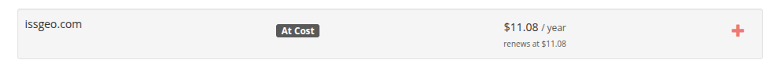
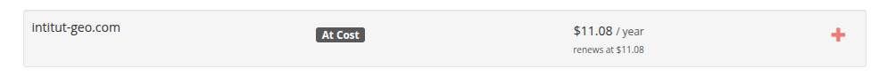
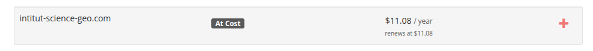
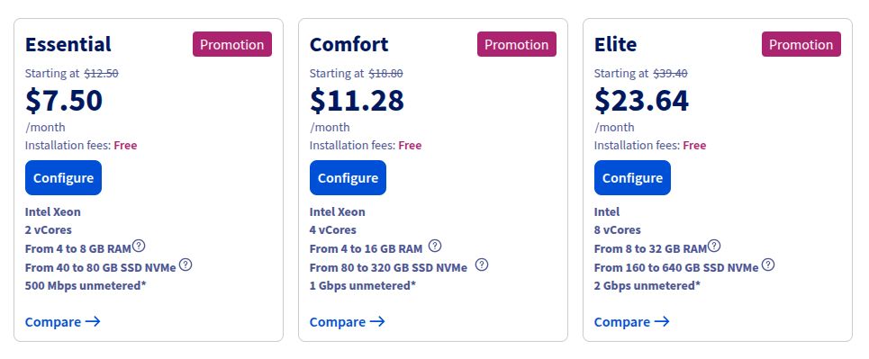

---

layout: default
title: Tarification
---

### Fonctionnalités à développer pendant les 3 mois

#### 1. Présenter l’Institut

- **Page d’accueil valorisante**
    
- **Page “À propos” avec historique, mission, valeurs**
    
- **Présentation de l’équipe dirigeante**
    

#### 2. Afficher les formations

- **Catalogue des formations**
    
- **Fiches détaillées (programme, durée, coût, débouchés)**
    

#### 3. Informer et interagir

- **Blog / Actualités**
    
- **Formulaire de contact**
    

---

### Services prévus

#### 1. **Nom de domaine**

- Nom de domaine personnalisé (`.org`, `.edu`, ou `.com`)
    
- **Durée :** 1 an
    
- **Prix estimé :** environ **15 €/an** (ex. chez OVH)

#### Proposition de domaines

##### issgeo.com

- prix: 11.08 $ / an

**[lien du catalogue](https://porkbun.com/checkout/search?prb=c54202b292&q=issgeo.com&tlds=&idnLanguage=&search=search&csrf_pb=ff179eb5bc453424fcf0654d39775312)**

##### institut-geo.com

- prix: 11.08 $ / an

**[lien du catalogue](https://porkbun.com/checkout/search?prb=a16f0ae4e8&q=intitut-geo.com&tlds=&idnLanguage=&search=search&csrf_pb=7b3bae220b77e5be8c8b127cf1ae1e13)**

##### institut-science-geo

- prix: 11.08 $ / an

**[lien du catalogue](https://porkbun.com/checkout/search?prb=d37f305cd7&q=intitut-science-geo.com&tlds=&idnLanguage=&search=search&csrf_pb=2743b87bf0a4883fb11393c60f72fd17)**

#### 2. **Serveur VPS OVH**

- **Usage :** hébergement de l’application (backend + frontend + DB)
    
- **Durée :** 3 mois pour la phase de dev
    
- **Prix estimé :**
    
    - VPS "Essential" (~2 vCPU, 4 Go RAM, 80 Go SSD) → 8 $/mois**
        
    - VPS "Comfort" (~2 vCPU, 8 Go RAM, 160 Go SSD) → **12 $/mois**
        
    - Je recommande le **Comfort**, donc **36 $ pour 3 mois**

**[lien du catalogue](https://us.ovhcloud.com/vps/)**

#### 3. **Conteneurisation Docker**

- Backend, base de données (PostgreSQL ou MariaDB), gestionnaire de contenu (ex. Strapi/Directus si utile pour le blog), éventuellement un reverse proxy Nginx.
    

#### 4. **Outils complémentaires open-source ou gratuits**

- **Formulaire de contact :** via backend ou service externe comme Formspree
    
- **Blog :** système de publication intégré (Markdown via CMS ou simple éditeur)
    
- **Monitoring :** Uptime Kuma (auto-hébergé)
    
- **Déploiement :** GitHub Actions ou un outil similaire
    

---

### Plan de développement (3 mois)

| Mois   | Activités prévues                                                                                                                               |
| ------ | ----------------------------------------------------------------------------------------------------------------------------------------------- |
| Mois 1 | - Installation du VPS et configuration de base- Configuration Docker, DB, nom de domaine- Développement : pages “Accueil”, “À propos”, “Équipe” |
| Mois 2 | - Catalogue de formations + fiches détaillées- Développement du blog + gestion des articles- Intégration formulaire de contact                  |
| Mois 3 | - Tests, ajustements UI/UX- Préparation production + documentation- Sécurité, sauvegardes, monitoring                                           |

### Estimation budgetaire pour 3 mois de developpement

En considerant ces differents services:
- Nom de domaine pour 1 an : 12 $
- Hebergement VPS option confort pour 12$/mois soit : 36 $ pour 3 mois
- Total : 48 $
---
